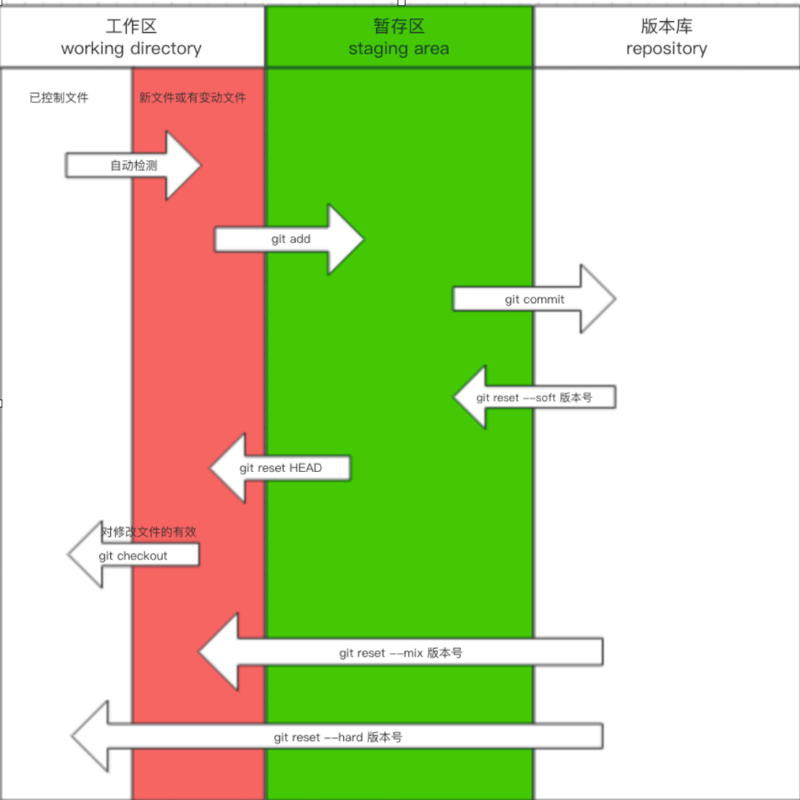
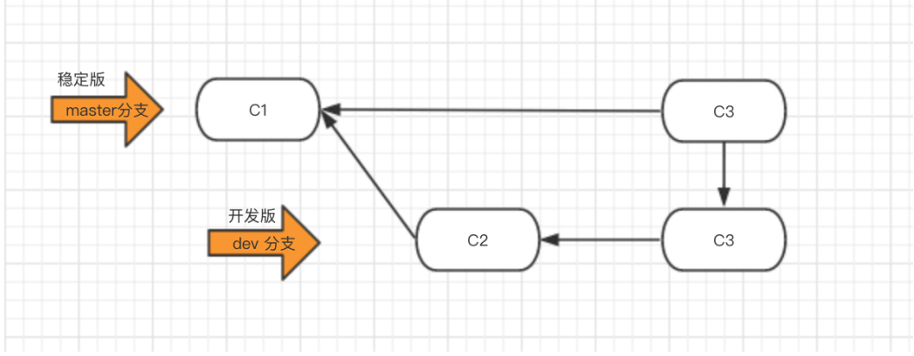

## 1. 快速入门
---
版本控制流程：创建文件夹 -> 初试化 -> 管理 -> 生成版本

- 创建文件夹
- 在文件夹中右键打开`git bash` 

| 命令 | 解释 |
| :--- | :--- |
| git init | 文件初试化，即：让git管理当前文件夹 |
| git status | 查看git当前 管理/未管理 的文件。绿色(已管理)，红色(未管理) |
| git add file_name | 添加文件被git管理，file_name = . 即：所有文件添加管理 |
| git config --global user.email "邮箱" git config --globle user.name "姓名" | 个人信息配置：邮箱，用户名【仅需开始第一次】 |
| git commit -m '描述信息' | 本地提交，生成一个版本 |
| git log | 查看版本信息 |

## 2. 回滚
---
- 回滚之前版本
	- `git log`  查看版本号
	- `git reset --hard 版本号` 回滚到版本号的版本
- 回滚回滚后的版本（已经回滚到之前的版本了，但是后悔了想回再回到之后的版本）
	- `git reflog` 可以显示回滚前的版本号
	- `git reset --hard 版本号` 回滚

## 3. 分支

---
| 命令                    | 解释                     |
|:----------------------- |:------------------------ |
| git branch              | 查看当前分支             |
| git branch 分支名       | 创建新分支               |
| git checkout 分支名     | 切换分支                 |
| git mege 要合并的分支名 | 合并分支（可能产生冲突） |
| git branch -d 分支名                        | 删除分支                         |

## 4. git工作流
---
工作时至少保留两个分支 --> master（主分支），dev（开发分支）

- master分支
	- 保存线上运行的正式版本（稳定版）
- dev分支
	- 在此分支上做开发，添加性能/修改代码
	- 测试没有问题，可合并到主分支上

## 5. github
---
github：代码托管仓库之一 （gitlab，gitee....）

- 流程
	- 注册账号
	- 创建仓库
	- 本地代码推送到github仓库

