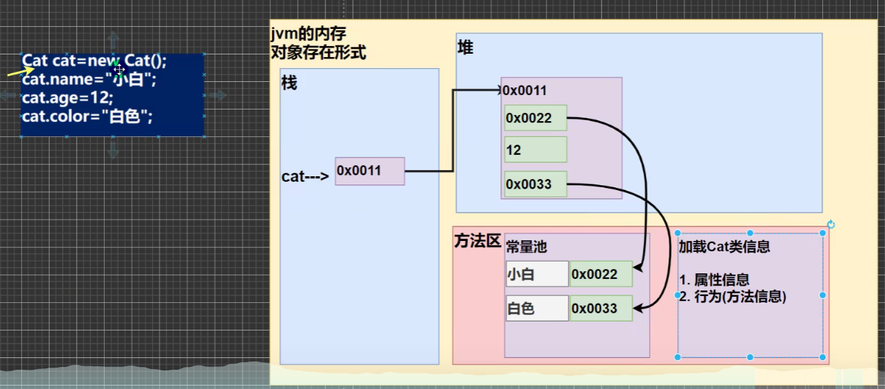
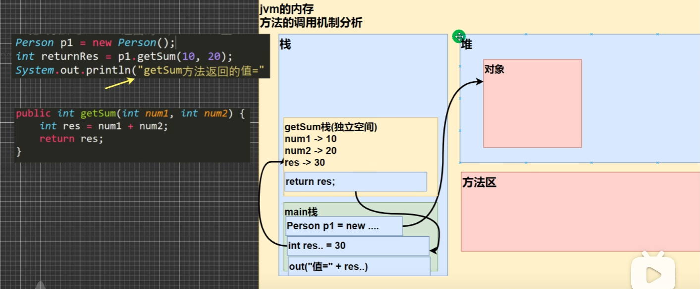
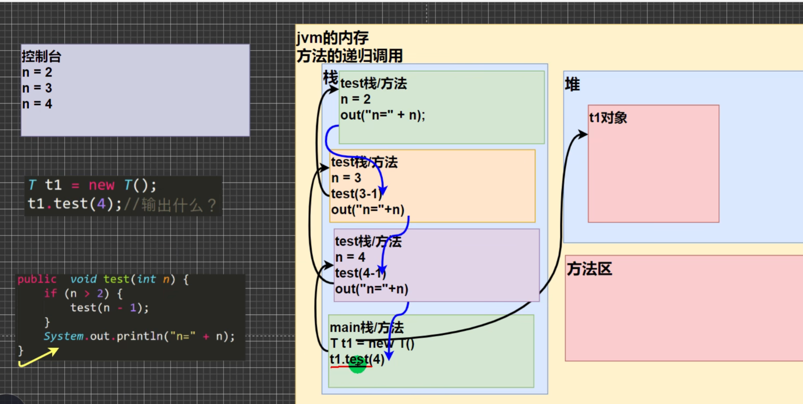
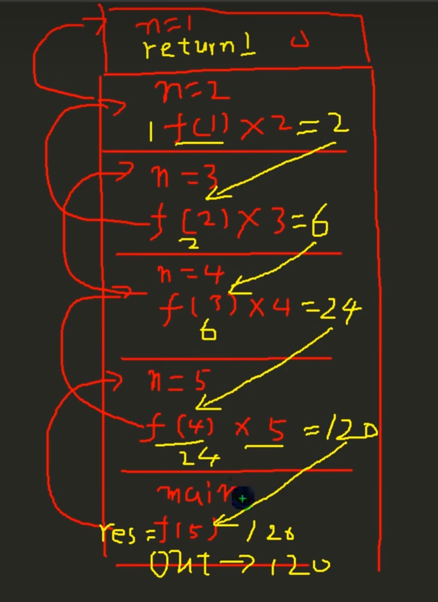
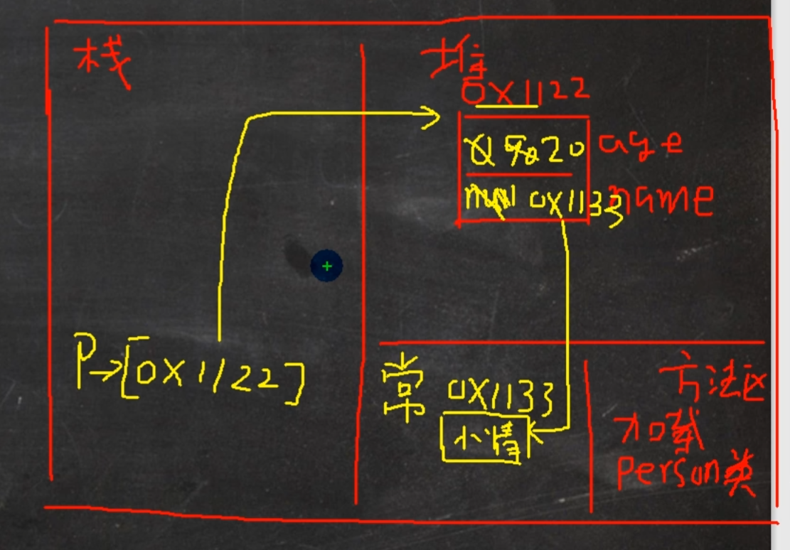

# 面对对象编程oop（初级）
## 类与对象
### 快速入门
就像是c语言中的结构体  
假如我们想定义以个 -猫类（属性 + 行为），那什么是猫呢？  
**猫类**：如果一个东西满足：**有名字，有年龄，四条腿走路，会抓老鼠**……我们就将它**称之为猫**  
**猫对象**：而根据我们定义的这个猫类，可以创建出很多**具体的猫，这就是猫对象**  
```java
class Cat//定义一个猫类
{
    String name;//名字
    int age;//年龄
    string color;//颜色
}
Cat cat1 = new Cat();//创建一只猫对象，new出来的空间才是真正的对象
cat1.name = "小白";  //就cat1只是指向对象而已，就好像 你的姓名，或者学号多少的人，其实都指的是你自己，你自己才是对象
cat1.age = 15;
cat1.color = "白色";
```

### 对象在内存中存在形式


### 属性/成员变量
1. 从概念或叫法上看：成员变量 = 属性 = field字段（即 成员变量是用来表示属性的）
2. 属性是类的一个组成部分，一般是基础数据类型，也**可以是引用类型（对象，数组）**

### 注意事项
1. 属性的定义语法和变量一样 示例： **访问修饰符 属性类型 属性名;**  
访问修饰符：控制属性的访问范围  
有四种访问修饰符 默认：private//后面详细介绍  
```java
class Cat
{
    protected String name;
    int age;
    String master[]; 
}
```
2. 属性的定义类型可以位任意类型，包含基本类型和引用类型
2. 属性如果**不赋值，有默认值**，规则和数组一样

### 如何创建对象
1. 先声明再创建  
   Cat cat;//声明  
   cat = new Cat();//创建，开辟空间  
2. 直接创建
   Cat cat = new Cat();  

### 如何访问属性
对象名。属性名;  
cat.name;  
cat.age;  

### 对象创建过程
1. java内存的结构分析
   1. 栈：一般存放基本数据类型（局部变量）
   2. 堆：存放对象（Cat cat，数组等）
   3. 方法区：常量池（常量，比如字符串），类加载信息
2. java创建对象流程简单分析
   ```java
   Person p = new Preson();
   p.name = "jack";
   p.age = 10;
   ```
   1. 先加载Person类信息（属性和方法信息，只会加载一次）
   2. 在堆中分配空间，进行默认初始化
   3. 把空间地址返回给 p，p就指向对象了
   4. 进行指定初始化

---
## 成员方法（函数）
### 基本介绍  
在某些情况下，我们需要定义成员方法（简称方法），比如人类：除了有一些属性外（年龄，姓名……）<br>我们人类还有一些行为（说话，跑步……）这时就要用成员方法完成

### 成员方法快速入门
1. 添加speak成员方法，输出：我是一只好人
2. 添加cal01成员方法，可以干……
   ```java
   class person
   {
    String name;
    int age;
    //方法
    //添加speak
    //1. public 表示方法公开
    //2. void 表示方法没有返回值
    //3. speak() spreak是方法名，()是形参列表
    //4. {}方法体 可以写我们要执行的代码
    public void speak()
    {
        System.out.println("我是一个好人");
    }
   }
   //方法使用
   //1.方法写好后，如果不调用，不会输出
   //2. 先创建duixiang，然后调用方法
   Person p1 = new Preson();
   p1.speak();//调用方法
   ```

### 方法的调用机制原理


#### 方法调用小结  
1. 当程序执行到方法时，就会开辟一个独立的空间（栈空间）
2. 当方法执行完毕，或执行到return语句时，就会返回
3. 返回到调用方法的地方
4. 返回以后，继续执行方法后面的代码

#### 成员方法的好处
1. 提高代码的复用性
2. 可以将实现的细节封装起来，然后供其他用户来调用即可

### 成员方法的定义
```java  
访问修饰符public 返回数据类型 （形参列表）
{
    方法体语句;
    return 返回值;
}
```
1. 参数列表 ：表示成员方法输入cal（int n）
2. 数据类型（返回类型）：表示成员方法输出，void表示没有返回值
3. 方法主体：表示为了实现某一功能代码块
4. return 语句不是必须

### 方法细节
#### 访问修饰符（作用是控制方法使用范围）  
   如果不写就是默认访问

#### 返回类型
   1. 一个方法最多有一个返回值
   2. 返回类型可以为任意类型，包含基本类型和引用类型
   3. 如果方法要求有返回数据类型，则方法最后为return 值; 而且要求返回类型必须和return值类型一样
   4. 如果方法是void，则方法体中可以没有return，或者只写return;

#### 方法名
遵循驼峰命名法，最好见名知意，表达出该功能的意思即可

#### 形参列表
1.  一个方法可以没有参数，也可以有多个参数
2.  参数类型可以为任意类型
3.  调用带参数的方法时，一定对应着参数列表传入相同类型或者兼容类型的参数
4.  方法定义时的参数称为形参，方法调用时称为实参，两者类型一定要，一致或兼容，个数，顺序一致

#### 方法体
里面写完成功能的具体的语句，可以为输入，输出，变量，运算，分支，循环，方法调用，但里面不能再定义方法  
方法不能嵌套定义

#### 调用
1. 同一个类中的方法调用：直接调用即可
```java
class A{
   public void print(int n){
      System.out.println("print方法被调用 n = " + n);
   }
   public void sayOk(){
      print(10);
      System.out.println("继续执行sayok")；
   }
}
```
2. 跨类中的方法A类调用B类方法：需要通过对象名调用。比如 对象名.方法名（参数）
```java
class B{
   public void hi(){
      System.out.println("b类中hi（）被执行");
   }
   public void m(){
      //创建a对象，然后调用方法 
      A a = new A();
      a.sayOk;//跨类调用
   }
}
```
3. 特别说明：跨类的方法调用和方法方法的访问修饰符相关

#### 类定义的完善
```java
class 类名{
   属性(成员变量);
   成员变量;
}
``` 

### 方法练习
```java
//输入数字判断奇偶，返回boolean类型
public class Try{
	public static void main(String[] args){
		AA a = new AA();
		if(a.isOod(7)){
			System.out.println("是奇数");
		}else{
			System.out.println("是偶数");
		}
	}
}
class AA{
	public boolean isOod(int num){
		if(num % 2 != 0){
			return true;
		}else{
			return false;
		}//写法一
		return num % 2 != 0 ? true;false;//写法二
		return num % 2 != 0;//写法三
	}
}
```

### 员方法传参机制（难点）
#### 基本数据类型的传参机制
参数（perameter）
```java
public class Try{
	public static void main(String[] args){
		int a = 10;
		int b = 20;
		AA aa = new AA();
		aa.swap(a,b);
		System.out.println("a = " + a + "b = " + b);
	}
}
class AA{
	public void swap(int a,int b){
		System.out.println("交换前a = " + a + "b = " + b);
		int t = a;
		a = b;
		b = t;
		System.out.println("交换后a = " + a + "b = " + b);
	}
}
```
**结论：
基本数据类型，传递的是值（值拷贝），形参的任何改变不影响实参
引用类型传递的是地址，可以通过形参影响实参**

### 克隆对象
编写一个copyP，可以复制一个P对象，返回复制的对象，克隆对象，注意要求得到的新对象和原来的对象是两个独立的对象，只是他们属性相同
```java
public class Try{
	public static void main(String[] args){
		Person p = new Person();
		p.name = "bbeb";
		p.age = 18;
		Mytools m = new Mytools();
		Person p1 = m.copyP(p);
		System.out.println("输出:p1.name=" + p1.name + "\tp1.age=" + p1.age);
	}
}
class Person{
	String name;
	int age;
}
class Mytools{
	public Person copyP(Person p){
		Person p1 = new Person();
		p1.name = p.name;
		p1.age = p.age;
		return p1;
	}
}
```

### 方法递归（recursion）调用
#### 基本介绍
简单的说：**递归就是方法自己调用自己**，每次调用时传入不同的变量，递归有助于编程者解决复杂问题，同时可以让代码变得简洁。

可以解决：
1. 各种数学问题：8皇后问题，汉诺塔，阶乘问题，迷宫问题，球和篮子的问题
2. 各种算法中也会使用到递归，例如快排，归并排序，二分查找，分治算法
3. 将用到栈解决的问题-->递归代码比较简洁

#### 递归调用机制
1. 打印问题
```java
//输出什么？
public void text(int n){
   if(n > 2){
      text(n - 1);
   }
   System.out.println("n = " + n);
}
```

1. 阶乘问题
```java
//阶乘(factorial)
public class Try {
    public static void main(String[] args) {
        Factorial factorial = new Factorial();
        System.out.println();
        System.out.println("10的阶乘：" + factorial.factorial(10));
    }
}

class Factorial {
    public int factorial(int n) {
        if (n == 1) {
            return 1;
        } else {
            return factorial(n - 1) * n;
        }
    }
}
```


#### 递归重要规则
1. 执行一个方法时，就创建一个新的受保护的独立空间（栈空间）
2. 方法的局部变量是独立的，不会相互影响，比如n变量
3. 如果方法中使用的是引用类型（比如数组，对象），就会共享该引用类型的数据
4. 递归必须向退出递归的条件逼近，否则就是无限递归，出现StackOverflowError，死龟了:)
5. 当一个方法执行完毕，或者遇到return，就会返回，遵守谁调用，就会将结果返回给谁，同时当方法执行完毕或者返回时，该方法也就执行完毕

#### 斐波那契数
斐波那契数：1，1，2，3，5，8，13·····给你一个整数n，求出它的值是多少
```java
public class Try{
	public static void main(String[] args){
		T t = new T();
		System.out.println("对应的斐波那契数为:" + t.f(5));
	}
}
class T {
	public int f(int n){
		if(n >= 1){
			if(n == 1 || n == 2){
			   return 1;
		    }else{
			   return f(n - 1) + f(n - 2);
		    }
		}else{
			System.out.println("请输入一个大于一的整数");
			return 0;
		}
	}
}
```

#### 猴子吃桃
有一堆桃子，猴子每天吃其中一半，并且多吃一个，第10天还想吃时还剩1个
```java
public class Try{
	public static void main(String[] args){
		T t = new T();
		System.out.println("第一天有" + t.tao(1) + "个桃子");
	}
}
class T {
	public int tao(int n){
		if(n == 10){
			return 1;
		}else if(n >= 1 && n <= 9){
			return (tao(n + 1) + 1) * 2;
		}else{
         System.out.println("桃子只够猴子吃10天哦，只能输入1-10的数")
			return 0;
		}
	}
}
```

#### 迷宫问题
1. 小球找到的路径和程序员设置的找路策略有关
2. 在得到小球路径时，可以先使用（下右上左），再改成（上右下左），看看路径是否会有变化
3. 测试回溯现象
4. 拓展：如何求出最短路径
```java
public class Try{
	public static void main(String[] args){
		//先创建迷宫，用二维数组int[] [] map = new int [8][7]
		//先规定，map数组的元素值：0代表可以走  1代表障碍物
		int map[][] = new int[8][7];
		//将上下两行和左右粮行全部设置为1
		for(int i = 0;i < 7;i++){
			map[0][i] = 1;
			map[7][i] = 1;
			map[i + 1][0] = 1;
			map[i + 1][6] = 1;
		}
		map[3][1] = 1;
		map[3][2] = 1;
		System.out.println("---原始地图---");
		for(int i = 0;i < map.length;i++){
			for(int j = 0;j < map[i].length;j++){
				System.out.print(map[i][j] + " ");
			}
			System.out.println();
		}
		T t = new T();
		t.find(map,1,1);
		System.out.println("\n---找路地图---");
		for(int i = 0;i < map.length;i++){
			for(int j = 0;j < map[i].length;j++){
				System.out.print(map[i][j] + " ");
			}
			System.out.println();
		}
	}
}
class T{
	//1. 找迷宫路径的方法为find
	//2.如果找到，就返回true，否则返回false
	//3.map就是二维数组，即表示迷宫地图
	//4.i，j就是老鼠位置坐标，起始位置为（1，1）
	//5.我们规定map数组各个值的含义
	//     0代表可以走  1代表障碍物   2代表已经走过了的路  3代表走过，但是走不通的路
	//6.当map[6][5] = 2就说明找到通路，可以结束，否则继续
	//7.找路方案按照 下 右 上 左
	public boolean find(int map[][],int i,int j){
		if(map[6][5] == 2){//说明已经找到
			return true;
		}else{
			if(map[i][j] == 0){//当前这个位置为0，表示能走
				//我们假定先可以走通
				map[i][j] = 2;
				//开始找路看是否真的能走通
				if(find(map,i + 1,j)){
					return true;
				}else if(find(map,i,j + 1)){
					return true;
				}else if(find(map,i - 1,j)){
					return true;
				}else if(find(map,i,j - 1)){
					return true;
				}else{
					map[i][j] = 3;
					return false;
				}
			}else{//这个位置为1，2，3  1代表障碍过不去  2代表走过，以免往回走   3代表这个位置是死路
				return false;
			}
		}
	}
}
```

#### 汉诺塔问题
```java
public class Try{
	public static void main(String[] args){
		T t = new T();
		t.hnt(5,'A','B','C');
	}
}
class T{
	//num为移动个数，a，b，c分别表示a塔 b塔 c塔
	public void hnt(int num, char a, char b, char c){
		if(num == 1){
			System.out.println(a + "->" + c);
		}else{
			//如果有多个盘，可以看成两个，最下面的和上面的所有
			//1. 先移动上面所有的盘到 b ，借助 c
			hnt(num - 1, a, c, b);
			//2. 把最下面的盘移动到 c
			System.out.println(a + "->" + c);
			//3. 再把 b 所以的盘移动到 c，借助 a
			hnt(num - 1, b, a, c);
		}
	}
}
```
汉诺塔问题本质是分治思想
要想解决 3 个盘 a -> c,就要解决 2 个盘 a -> b
想要解决 2 个盘 a -> b,就要解决 1 个盘a -> c

#### 八皇后问题
在8 * 8 的棋盘上放 8 个皇后，任意两个皇后都不能处于同一行，同一列，或者同一斜线上，有多少种摆法
###方法重载(overload)

#### 基本介绍
java中允许同一个类中，多个同名方法的存在，但要求形参列表不一样

#### 好处
1. 减轻了起名的麻烦
2. 减轻了记名的麻烦

#### 注意事项和使用细节
1. 方法名：必须相同
2. 形参列表：必须不同（参数类型或个数或顺序，至少有一个不同，参数名无要求）
3. 返回类型：无要求

#### 例子
```java
//编写m方法，分别接受一个int，两个int，一个String
//返回平方，相乘，字符串信息
public class Try{
	public static void main(String[] args){
		T t = new T();
		t.m(2);
		t.m(2,3);
		t.m("hhh");
	}
}
class T {
	public void m(int x){
		System.out.println(x * x);
	}
	public void m(int x,int y){
		System.out.println(x * y);
	}
	public void m(String x){
		System.out.println(x);
	}
}
```
```java
//编写max方法
//1. 返回两个int中最大值
//2. 返回两个double中最大值
//3. 返回三个double中最大值
public class Try{
	public static void main(String[] args){
		T t = new T();
		t.max(3,2);
		t.max(7.0,9.0);
		t.max(6.0,4.0,8.0);
	}
}
class T {
	public void max(int x,int y){
		int max = x > y ? x : y;
		System.out.println("最大值：" + max);
	}
	public void max(double x,double y){
		double max = x > y ? x : y;
		System.out.println("最大值：" + max);
	}
	public void max(double x,double y,double z){
		double max = x > y ? x : y;
		max = max > z ? max : z; 
		System.out.println("最大值：" + max);
	}
}
```

### 可变参数（variable parameters)
#### 基本概念
java允许将同一类中多个同名同功能但**参数个数不同的方法**，封装成一个方法,就可以通过可变参数实现

#### 基本语法
访问修饰符  返回类型  方法名(数据类型...形参名){ }

#### 例子
输入几个数求和
```java
public class Try{
	public static void main(String[] args){
		T t = new T();
		System.out.println("sum = " + t.sum(1,2,3,4));
	}
}
class T {
	//int...表示接收的是可变参数，类型是int，即可以接受多个int（ 0 --- 多）
	//使用可变参数时，可以当做数组来使用
	//数组即可遍历求和
	public int sum(int... nums){
		int res = 0;
		for(int i = 0; i < nums.length;i++){
			res += nums[i];
		}
		return res;
	}
}
```

#### 注意事项和使用细节
1. 可变参数的实参**可以为0个或者任意多个**
2. 可变参数的实参可以为数组
3. **可变参数的本质就是数组**
4. **可变参数库和普通类型的参数一起**放在新参列表，但**必须保证可变参数在最后**
5. **一个形参列表只能出现一个可变参数**

#### 例题
一个方法分别实现
1. 返回名字 和两门课总分
2. 返回名字 和三门课总分
3. 返回名字 和五门课总分
```java
public class Try{
	public static void main(String[] args){
		T t = new T();
		System.out.println(t.x("小明",80,90));
		System.out.println(t.x("小郑",80,90,70));
		System.out.println(t.x("呵呵",80,90,80,90,90));
	}
}
class T {
	double totalScores = 0;
	public String x(String name,double... scores){
		for(int i = 0;i < scores.length;i++){
			totalScores += scores[i];
		}
		return name + "的" + scores.length + "门课总分：" + totalScores;
	}
}
```

### 作用域(scope)
#### 基本使用
面向对象中，变量的作用域是**非常重要的知识点**，相对来说不是特别好理解，要求深刻掌握变量作用域
1. 在java编程中，主要的变量就是属性(成员变量)和局部变量
2. 我们说的局部变量一般是指在成员方法中定义的变量
3. java中作用域的分类
   全局变量：也就是属性，作用域为整个类体
   局部变量：也就是除了属性之外的其他变量，作用域为定义它的代码块中
4. 全局变量可以不赋值，直接使用，因为有默认值，局部变量必须赋值，才能使用，因为没有默认值

#### 注意事项和细节使用
1. 属性和局部变量可以重名，访问时遵循就近原则
2. 在用同一个作用域中，比如在同一个成员方法中，两个局部变量，不能重名
3. **属性生命周期较长**，伴随着对象的创建而创建，伴随着对象的死亡而死亡。
**局部变量，生命周期较短**，伴随着它的代码块执行而创建，伴随着代码块的结束而死亡。
4. 作用域范围不同
   全局变量/属性：可以被本类是使用，或者其他类使用（通过对象的调用）
   局部变量：只能在本类中对应的方法中使用
5. 修饰符不同
   全局变量/属性 可以加修饰符
   局部变量不可以加修饰符

### 构造方法/构造器(constructor)
#### 基本介绍
构造方法也叫**构造器**，是类的一种特殊的方法，它**主要作用是完成对对象的初始化**
特点：
1. 方法名与类名相同
2. 没有返回值
3. 在创建对象时，**系统会自动调用该类构造器完成对对象的初始化**

#### 基本语法
[修饰符] 方法名(形参列表){
	方法体;
}
说明：
1. 构造器的修饰符可以默认
2. **构造器没有返回值**
3. 方法名和类名必须一样
4. 形参列表和成员方法一样的规则
5. 构造器的调用，系统完成
```java
public class Try{
	public static void main(String[] args){
		//完成对对象的初始化
		Person p = new Person("jack",27);
	}
}
class Person {
	String name;
	int age;
	public Person(String pname,int page){
		name = pname;
		age = page;
	}
}
```

#### 注意事项和使用细节
1. 一个类可以定义多个不同的构造器，即构造器重载
例如：我们可以再给person类定义一个构造器，用来创建对象的时候，只指定人名，不指定年龄
2. 构造器名和类名相同
3. 构造器没有返回值
4. 构造器是完成对象的初始化，并不是创建对象
5. 在创建对象时，系统会自动的调用该类的构造方法
6. **如果程序员没有定义构造器，系统会自动给类生成一个默认无参的构造器(也叫默认构造器)** 可以javap(反编译)
7. **一旦定义了自己的构造器，默认构造器就覆盖了，就不能再使用默认的无参构造器，除非自己定义一个无参构造器**

#### 对象创建的流程分析
案例
```java
class Person{
	int age = 90;
	String name;
	Person(String n,int a){
		name = n;
		age = a;
	}
}
Person p = new Person("小倩",20);
```

流程分析
1. 加载Person类信息(Person.class)，只会加载一次
2. 在堆中分配空间（地址）
3. **完成对象初始化**
   1. 默认初始化 age = 0 name = null
   2. 显示初始化 age = 90;
   3. 构造器初始化 name = "小倩"  age = 20;
4. 对象在堆中的地址，返回给p(对象名，也可以理解成对象的引用)

### this
什么是this
java虚拟机会给每个对象分配this，代表**当前对象**
**小结：简单的说，哪个对象调用，this就代表哪个对象**

#### 注意事项和使用细节
1. this关键字可以用来访问本类的属性，方法，构造器
2. **this由于区分当前类的属性和局部变量**
3. **访问成员方法的语法：this.方法名(形参列表);**
4. **访问构造器语法：this(形参列表);注意只能在构造器中使用(即只能在构造器中访问另外一个构造器，且必须放在第一行)**
5. this不能在类定义的外部使用，只能在类定义的方法中使用 
