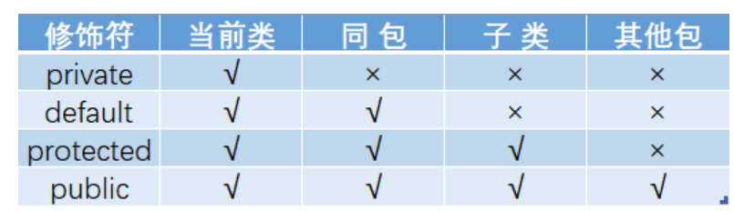
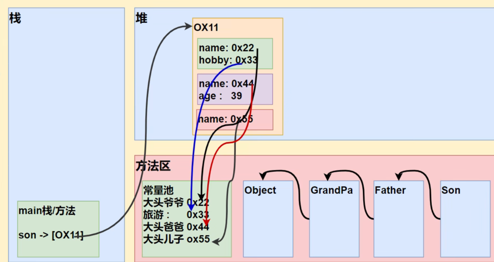

# 面对对象编程(中级)
## IDEA
### 介绍：IDE(集成开发工具)
1. IDEA 全称 IntelliJ IDEA
2. 业界公认最好的java开发工具
3. IDEA时JetBrains公司的产品，总部在捷克的首都布拉格
4. 除了支持Java开发，还支持HTNML，CSS，PHP，MySQL，Python

### IDEA常用快捷键
1. **删除当行 (ctrl + y)**，也可以自己配置 ctrl + d
2. **复制当行(ctrl + d)**
3. **补全代码 alt + /**
4. 添加**注释**和取消注释 **ctrl + /**(第一次是添加，第二次是取消)
5. **倒入该行需要的类** 先配置 auto import，然后使用**alt + enter**
6. **快速格式化代码 ctrl + alt + L**
7. **快速运行程序 shift + f10**
8. **生成构造方法等 alt + insert**[提高开发效率]
9. 查看一个**类的层级关系 ctrl + H**[学习继承后，非常有用]
10. 将**光标放在一个方法上，输入 ctrl + B** ，可以选择**定位到哪个类的方法**[学习继承后，非常有用]
11. **自动分配变量名 ，通过在后面.var**
12. ……等

### 模板(template)
file ---> setting ---> editor --->live templates
可以**查看**有哪些模板快捷键/可以自己**增加模板**
可以高效开发，提高效率
```java
    //main模板
    public static void main(String[] args) {
        //sout模板
        System.out.println();
        //fori模板
        for (int i = 0; i < 10; i++) {

        }
```

---
## 包
### 三大作用
1. **区分相同名字的类**
2. 当类很多时，可以很好的管理类
3. 控制访问范围

### 基本语法
package com.xxx;
说明：
1. package 关键字，表示打包
2. com.xxx；表示包名

### 包本质分析(原理)
**实际上就是创建不同的文件加夹来保存类文件**
**包 = 文件夹**

### 包的命名
#### 规则
只能包含数字，字母，下划线，小圆点，但不能用数字开头，不能时关键字或者保留字
demo.class.exec1//错  class是关键字
demo.12a//错 12a是数字开头的
demo.ab12.oa//对

#### 规范
**一般是小写字母 + 小圆点
com.公司名.项目名.业务模块名**
例如：
com.sina.crm.user//用户模块
com.sina.crm.order//订单模块
com.sina.crm.utils//工具类

### 常用的包
一个包下面，包含很多的类，java常用的有：
java.lang //lang是基本包，默认引入，不需要再引入
java.util //util包，系统提供的工具包，工具类，使用Scanner
java.net  //网络包，网络开发
java.awt //是做java的界面开发，GUI

### 使用细节
1. package的作用声明当前类所在的包，需要放在类的最上面，一个类中最多只有一个package
2. import指令，位置放在package的下面，在类定义前面，可以有多句且没有顺序要求。

#### 如何导入包
**语法：import 包;**
我们**引入一个包**的主要**目的是要使用该包下面的类**
比如：**import java.util.Scanner**;就是**引入Scanner类**
**import java.util.*，**表示将**util包所有类都引入**

#### 类定义完善
```java
package 包名;
class 类名{
    成员变量/属性;
    构造器;
    成员方法;
}
```

---
## 访问修饰符
### 基本介绍
java提供四种访问修饰符控制方法和属性(成员变量)的访问权限(范围)
1. **公开**级别：**public** 修饰，**对外公开**
2. **受保护**级别：**protected** 修饰，**对子类和同一个包中的类公开**
3. **默认**级别：**default没有修饰符**号，**向同一个包的类公开**
4. **私有**级别：**private** 修饰，**只有类本身可以访问，不对外公开**


### 使用细节
1. 修饰符可以用来修饰类中的属性，成员方法及类
2. **只有默认的和public才能修饰类**，并且遵循上述访问权限的特点
3. 成员方法的访问权限和属性完全以一样

---
## OOP三大特征(重点)
### 封装(encapsulation)
#### 介绍
封装就是把抽象出来的数据(属性)和对数据的操作(方法)封装在一起，数据被保护在内部，程序的其他部分只有通过被授权的操作(方法)，才能对数据进行操作

#### 好处
1. 隐藏实现细节
2. 可以对数据进行验证，保证安全合理

#### 封装实现步骤(三步)
1. **将属性进行私有化private** [不能直接修改属性]
2. 提供一个**公共的 public set方法**，由于**对属性判断并赋值**
```java
public void setXxx(类型 参数名){
    //加入数据验证的业务逻辑
    属性 = 参数名;
}
```
3. 提供一个**公共的get方法**，由于**获取属性的值**
```java
public 数据类型 getXxx(){//权限判断，Xxx也是某个属性
    return xx;
}
```
快捷键alt + insert 选择getter and setter，快捷创建get和set方法
set方法可以放进构造器中，以防我们设置的条件判断失效

#### 练习
定义Account类
1. Account类要求具有属性：姓名(长度在2-4)，余额(必须>20)，密码(必须6位)
```java
public class Try {
    public static void main(String[] args) {
        Account account = new Account("hhhhhhh", 20, "1234567");
        account.getInfo();
    }
}
public class Account {
    private String name;
    private int money;
    private String passworld;

    public Account(String name, int money, String passworld) {//含参构造器
        this.setName(name);
        this.setMoney(money);
        this.setPassworld(passworld);
    }

    public Account() {//无参构造器
    }

    public String getName() {
        return name;
    }

    public void setName(String name) {
        if (name.length() >= 2 && name.length() <= 4) {
            this.name = name;
        } else {
            System.out.println("姓名长度不符合规范，已设置默认姓名");
            this.name = "无名氏";
        }
    }

    public int getMoney() {
        return money;
    }

    public void setMoney(int money) {
        if (money >= 20) {
            this.money = money;
        } else {
            System.out.println("你个穷逼，没办法给你20吧");
            this.money = 20;
        }
    }

    public String getPassworld() {
        return passworld;
    }

    public void setPassworld(String passworld) {
        if (passworld.length() == 6) {
            this.passworld = passworld;
        } else {
            System.out.println("密码不符合要求，以设定成默认密码");
            this.passworld = "123456";
        }
    }

    public void getInfo() {
        System.out.println("name = " + this.getName() + "\nmoney = " + this.getMoney() + "\npassworld = " + this.getPassworld());
    }
}

```

### 继承(extends)
#### 基本介绍
**继承可以解决代码复用**，让我们都编程更加靠近人类思维，党夺冠雷存在相同的属性(变量)和方法时，
可以从这些类中抽象出父类，在父类中定义这些相同的属性和方法，所有的子类不需要重新定义这些
属性和方法，只需要通过 **extends** 来声明继承分类即可

#### 继承的基本语法
```java
class 子类 extends 父类{

}
```
1. 子类就会自动拥有父类定义的属性和方法
2. 父类又叫 超类，基类
3. 子类又叫派生类
继承的好处
1. 代码复用性提高
2. 代码扩展性和维护性提高

#### 细节
1. **子类继承了所有的属性和方法**，但时**私有的属性和方法不能在子类直接访问**，要通过父类提供公共的方法去访问
2. **子类必须调用父类的构造器**，完成父类的初始化
3. 当**创建子类**对象时，**不管使用子类哪个构造器，默认情况下总会去调用父类的无参构造器**，如果**父类没有提供无参构造器**，则必须**在子类的构造器中用 super 去指定使用父类都哪个构造器**完成对父类的初始化工作，否则，编译不会通过
4. 如果**希望指定去调用父类的某个构造器**，则**显示的调用**一下：**super(形参列表);**
5. **super 在使用**时，需要放**在构造器第一行**
6. **super() 和 this()** 都只能放在构造器第一行，因此这两个方法**不能共存在一个构造器中**
7. java**所有类都是Object类的子类**
8. **父类构造器的调用不限于直接父类**，将一值往上追溯到Object类(顶级父类)
9. **子类最多只能继承一个父类**(直接继承)，即java中是**单继承机制**
思考：如**何让A类继承B类和C类(让B类继承C类)**
10. 不能滥用继承，子类和父类之间必须满足is- a的逻辑关系

#### 本质(重要)
当子类继承父类时，创建子类对象时，内存中发生什么？
当子类对象创建好后，建立**查找的关系**
```java
public class Try {
    public static void main(String[] args) {
        Son son = new Son();
        //按照查找规则来返回信息
        //1. 首先看子类是否有该属性
        //2. 如果子类有这个属性，并且可以访问，则返回信息
        //3. 如果子类没有这个属性，就看父类有没有这个属性(如果父类有该属性，
        //并且可以访问，就返回信息)
        //4. 如果父类没有就按照(3)的规则，继续找上级父类，知道Object类
        System.out.println("name = " + son.name + "\nage = " + son.age + "\nhobby = " + son.hobby);
    }
}

class GrandPa {
    String name = "大头爷爷";
    String hobby = "旅游";
}

class Father extends GrandPa {
    String name = "大头爸爸";
    int age = 39;
}

class Son extends Father {
    String name = "大头儿子";
}
```


### 多态(polymorphic)
#### 基本介绍
方法或对象具有**多种形态**，是面对对象的第三大特征，**多态是建立在封装和继承基础之上的。**

#### 多态的具体体现
1. 方法的多态 
**重写和重载就体现多态**
2. 对象的多态(核心，重点，困难)
   1. 一个对象的**编译类型和运行类型可以不一致**
   **eg：Animal animal = new Dog()[animal编译类型是Animal，运行类型是Dog]
   animal = new Cat();[animal的运行类型变成了Cat，编译类型仍然Animal]**
   2. 编译类型在定义对象时，就确定了，不能改变
   3. **运行类型是可以变化的**
   4. 编译类型看定义时 = 号的左边，运行类型 = 号的右边 

#### 注意事项和细节讨论
1. **多态的前提**是：两个对象(类)**存在继承关系**
2. 多态的**向上转型**
    1. **本质：父类的引用指向了子类的对象(向上转型)**
    2. **语法：父类类型 引用名 = new 子类类型();**
   **Animal animal = new Cat();**
    3. 特点：编译类型看左边，运行类型看右边。
   **可以调用父类中的所有成员**(须遵守访问权限)
   **不能调用子类中特有成员**，因为在**编译阶段，能调用哪些成员，是由编译类型来决定的**
   最终运行效果看子类的具体实现！

3. 多态的**向下转型**
   1. **语法：子类类型 引用名 = (子类类型) 父类引用;**
   2. 只能强转父类的引用，不能强转父类的对象
   3. **要求父类的引用必须指向的是当前目标类型的对象**
   4. 当向下转型后，**可以调用子类类型中所有的成员**
```java
public class Try {
    public static void main(String[] args) {
        //向上转型
        Animal animal = new Cat("大郎", 8);
        //可以使用父类所有方法，但是不能访问子类特有方法
        animal.say();
        animal.sleep();
        System.out.println("=========");
        //向下转型
        Cat cat = (Cat) animal;
        cat.catchM();
    }
}

class Animal {
    String name = "动物";
    int age = 10;

    public Animal(String name, int age) {
        this.name = name;
        this.age = age;
    }

//    public void getInfo() {
//        System.out.println("name=" + name + "age=" + age);
//    }

    public void say() {
        System.out.println("┗|｀O′|┛ 嗷~~");
    }

    public void sleep() {
        System.out.println("我睡了");
    }
}

class Cat extends Animal {
    public Cat(String name, int age) {
        super(name, age);
    }

    public void say() {
        System.out.println("喵喵~~");
    }

    public void catchM() {
        System.out.println("我抓到老鼠了");
    }
}
```
4. **属性没有重写**之说，**属性的值看编译类型**
```java
public class Try {
    public static void main(String[] args) {
        Base base = new Sub();
        System.out.println("base.count=" + base.count);
    }
}

class Base {
    int count = 10;
}

class Sub extends Base {
    int count = 20;
}
//base.count = 10直接看编译类型+
```
5. **instenceof** 比较操作符，用于判断**对象的运行类型**是否位 **XX类型或 XX类型的子类型**
```java
public class Try {
    public static void main(String[] args) {
        BB bb = new BB();
        //bb类是否是AA类或者AA类的子类
        System.out.println(bb instanceof AA);//true
        System.out.println(bb instanceof BB);//true
        System.out.println("=======");
        AA aa = new BB();//向上转型
        System.out.println(aa instanceof AA);//true
        System.out.println(aa instanceof BB);//true
    }
}

class AA {
}

class BB extends AA {
}
```

#### java的动态(dynamic)绑定机制(非常非常重要)
1. 当调用**对象方法**的时候，**该方法会和该对象的内存地址/运行类型绑定**
2. 当调用**对象属性**时，**没有动态绑定机制**，哪里声明，哪里使用
```java
public class Try {
    public static void main(String[] args) {
        A a = new B();
        System.out.println(a.sum());//40 - > 30
        System.out.println(a.sum1());//30 - > 20
    }
}

public class A {
    public int i = 10;
    public int sum() {
        return getI() + 10;
    }
    public int sum1() {
        return i + 10;
    }
    public int getI() {
        return i;
    }
}
public class B extends A {
    public int i = 20;
    //public int sum() {
    //    return i + 20;
    //}
    public int getI() {
        return i;
    }
    //public int sum1() {
    //    return i + 20;
    //}
}
```

#### 多态的应用
##### 多态数组
数组的**定义类型为父类类型，里面保存的实际元素类型是子类类型**
###### 应用
1. 父类：创建一个Person类(name,age,say()方法)
子类：一个Student类(特有属性score，特有方法teach),一个Teacher类(特有属性salary，特有方法study)
2. 如何调用子类特有方法?
```java
package com.xtz;

public class Try {
    public static void main(String[] args) {
        Person person[] = new Person[5];
        person[0] = new Person("人类", 0);
        person[1] = new Student("xiaoming", 18, 100);
        person[2] = new Student("xiaogang", 18, 99);
        person[3] = new Teacher("ligang", 37, 20000);
        person[4] = new Teacher("haoren", 40, 21000);
        //循环调用say方法
        for (int i = 0; i < person.length; i++) {
            System.out.println(person[i].say());
            //类型判断 + 匿名对象 + 向下转型
            if (person[i] instanceof Student) {
                ((Student) Person[i]).study();//向下转型(匿名对象)
                //或者
                //Student student = (Student) Person[i];
                //student.study();
            }
            if (person[i] instanceof Teacher) {
                ((Teacher) Person[i]).teach();
            }
        }
    }
}
public class Person {
    private String name;
    private int age;
    public Person(String name, int age) {
        this.name = name;
        this.age = age;
    }
    public String getName() {
        return name;
    }
    public void setName(String name) {
        this.name = name;
    }
    public int getAge() {
        return age;
    }
    public void setAge(int age) {
        this.age = age;
    }
    public String say() {
        return "name= " + name + "\tage= " + age;
    }
}
public class Student extends Person {
    private double score;
    public Student(String name, int age, double score) {
        super(name, age);
        this.score = score;
    }
    public double getScore() {
        return score;
    }
    public void setScore(double score) {
        this.score = score;
    }
    public String say() {
        return super.say() + "\tscore= " + score;
    }
    public void study() {
        System.out.println("学生" + getName() + "正在学习");
    }
}
public class Teacher extends Person {
    private double salary;
    public double getSalary() {
        return salary;
    }
    public void setSalary(double salary) {
        this.salary = salary;
    }
    public Teacher(String name, int age, double salary) {
        super(name, age);
        this.salary = salary;
    }
    public String say() {
        return super.say() + "\tsalary= " + salary;
    }
    public void teach() {
        System.out.println("老师" + getName() + "正在教书");
    }
}
```
##### 多态参数
方法定义的**形参类型为父类类型**，**实参类型允许为子类类型**
###### 应用
定义员工类Employee，包含姓名和月工资(private)，以及计算年工资getAnnual的方法。
普通员工和经理继承了员工，经理类多了奖金bonus属性和管理manage方法，普通员工类多了work方法，普通员工和经理类要求分别重写getAnnual方法
```jack
public class Try {
    public static void main(String[] args) {
        Worker jack = new Worker("jack", 2500);
        Manger simth = new Manger("simth", 5000, 20000);
        Try aTry = new Try();
        aTry.showE(jack);
        aTry.showE(simth);
        aTry.testW(jack);
        aTry.testW(simth);
    }

    public void showE(Employee e) {
        System.out.println(e.getAnnual());
    }

    public void testW(Employee e) {
        if (e instanceof Worker) {
            System.out.println(((Worker) e).work());
        } else if (e instanceof Manger) {
            System.out.println(((Manger) e).manage());
        } else {
            System.out.println("");
        }
    }
}
public class Employee {
    private String name;
    private double money;
    public Employee(String name, double money) {
        this.name = name;
        this.money = money;
    }
    public String getName() {
        return name;
    }
    public void setName(String name) {
        this.name = name;
    }
    public double getMoney() {
        return money;
    }
    public void setMoney(double money) {
        this.money = money;
    }
    public double getAnnual() {
        return 12 * this.money;
    }
}
public class Worker extends Employee {
    public String work() {
        return "员工" + getName() + "正在工作";
    }

    @Override
    public double getAnnual() {
        return super.getAnnual();
    }

    public Worker(String name, double money) {
        super(name, money);
    }
}
public class Manger extends Employee {
    private double bonus;
    public String manage() {
        return "经理" + getName() + "正在管理";
    }
    public double getAnnual() {
        return super.getAnnual() + bonus;
    }
    public Manger(String name, double money, double bonus) {
        super(name, money);
        this.bonus = bonus;
    }
    public double getBonus() {
        return bonus;
    }
    public void setBonus(double bonus) {
        this.bonus = bonus;
    }
}
```

---
## super关键字
### 基本介绍
super代表父类的引用，**用于访问父类的属性，方法，构造器**

### 基本语法
1. **访问父类的属性**，但不能访问父类的private属性：**super.属性名**
2. **访问父类的方法**，但不能访问父类的private方法：**super.方法名(参数列表);**
3. **访问父类的构造器：super(参数列表);只能放在构造器的第一句，只能出现一句！**

### 细节和好处
1. 调用父类的构造器的**好处(分工明确，父类属性由父类初始化，子类属性由子类初始化)**
2. 当子类中有和父类中成员(属性和方法)重名时，为了**访问父类的成员，必须通过super**。如果没有重名，使用super，this，直接访问是一样的效果！
3. super的访问**不限于直接父类**，如果爷爷类和本类中有同名的成员，也可以使用super去访问爷爷类的成员，**如果多个基类中都同名的成员，使用super访问遵循就近原则**

### super和this的比较


---
## 方法重写/覆盖(override)
### 基本介绍
方法重写就是子类的一个方法，和父类的某个方法的**名称，返回类型，参数一样**，那么我们就说子**类这个方法覆盖了父类的方法**

### 注意事项和使用细节
1. 子类的方法的**参数，方法名称**，要**和父类的完全一样**，或者父类返回类型的子类
例如：
public Object getInfo()
public String getInfo()
1. **子类方法不能缩小父类的访问权限**
例如：
void sayOk()
public void sayOk()

---
## 方法重写(overwrite)和重载的区别

```java
public class Try {
    public static void main(String[] args) {
        Person jack = new Person("jack", 30);
        System.out.println(jack.say());
        System.out.println("============");
        Student mack = new Student("mack", 18, "123456", 89);
        System.out.println(mack.say());
    }
}
public class Person {
    private String name;
    private int age;

    public Person(String name, int age) {
        this.name = name;
        this.age = age;
    }

    public String say() {
        return "name = " + this.name + "\nage = " + this.age;
    }
}
public class Student extends Person {
    private String id;
    private double score;

    public Student(String name, int age, String id, double score) {
        super(name, age);
        this.id = id;
        this.score = score;
    }

    public String say() {
        return super.say() + "\nid = " + this.id + "\nscore = " + this.score;
    }
}
```

---
## Object类详解,垃圾回收机制
### == 和equals的对比
#### == 是比较运算符
1. == ：既可以**判断基本类型**，又可以判断引用类型
2. == ：如果判断基本类型，判断的是**值是否相等**
```java
public class Try {
    public static void main(String[] args) {
        int i = 10;
        double d = 10.0;
        System.out.println(i == d);//true
    }
}
```
3. == ：如果**判断引用类型**，判断的是**地址是否相等**，即判定是不是一个对象

#### equals方法
**指示其他某个对象是否与此对象 “相等”**
1. equuals : 是Object类中的方法，**只能判断引用类型**，**看源码(ctel + b)**
2. 默认**判断的是地址是否相等**，**子类**中往往**重写该方法**，用于判断内容是否相等
```java
//源码 ， object类的 equals方法
public boolean equals(Object anObject) {
        if (this == anObject) {                //如果传进来的是同一个对象
            return true;//返回true
        }
        if (anObject instanceof String) {      //判断类型
            String anotherString = (String)anObject;//向下转型
            int n = value.length;
            if (n == anotherString.value.length) {//如果长度相同
                char v1[] = value;
                char v2[] = anotherString.value;
                int i = 0;
                while (n-- != 0) {             //一个一个比较字符
                    if (v1[i] != v2[i])
                        return false;
                    i++;
                }
                return true;
            }
        }
        return false;
    }
```

#### hushCode方法
**返回该对象的哈希值**
1. 提高具有哈希结构的容器的效率
2. 两个引用，如果指向的是同一个对象，则哈希值肯定一样
3. 两个引用，如果指向的是不同对象，则哈希值是不一样的
4. 哈希值主要根据地址好来的，不能完全将哈希值等价于地址

#### toString方法
1. 默认返回：全类名(包名 + 类名) + @ + 哈希值的十六进制，子类往往重写toString方法，用于返回对象的信息
2. 重写toString方法，打印对象或者拼接对象时，都会自动调用该类对象的toString形式
3. 当直接输出一个对象时，toString方法会被默认调用
```java
//源码
public String toString() {
        return getClass().getName() + "@" + Integer.toHexString(hashCode());
    }
```

#### finalize方法(几乎不会用)
**当垃圾回收器确定不存在对该对象的更多引用时，由对象的垃圾回收器调用此方法，做出一些释放资源的操作**
1. 当对象被回收时，系统会自动调用该对象的finalize方法，子类可以重写该方法
2. 什么时候被回收：**当某个对象没有任何引用时**，则jvm就认为这个对象**是一个垃圾对象**，就会使用垃圾回收机制来销毁该对象，
**在销毁该对象前，先调用finalize方法**
3. 垃圾回收机制的调用，由系统来决定，也可以**通过System.gc() 主动触发垃圾回收机制**

---
## 断点调试
1. 在开发过程中，可以通过的断点调试，一步步看源码执行过程，从而发现错误所在。
2. 在断点调试中，是运行状态，**是以对象运行类型来执行的**

### 介绍
1. 断点测试是指在程序的某一行设置一个断点，调试时，程序运行到这一行就会停住，
然后你可以一步步往下调试，调试过程中可以看各个变量当前的值，出错的话，调试到出错的代码行即显示错误，停下，进行分析从而找到bug
2. 断点调试也可以帮助我们查看java底层源代码的执行过程，提高java水平

### 快捷键
跳入方法内：F7  
逐行执行：F8  
跳出方法：shift + F8  
resume，执行到下一个断点：F9  